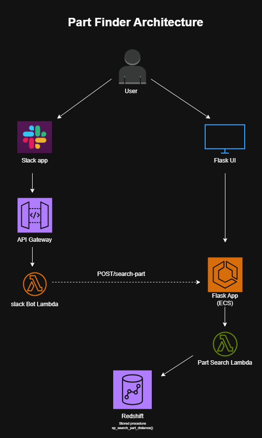
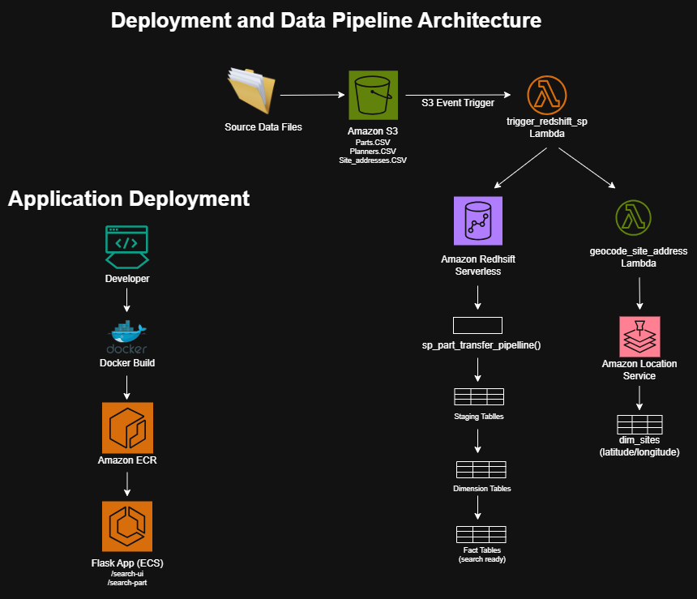
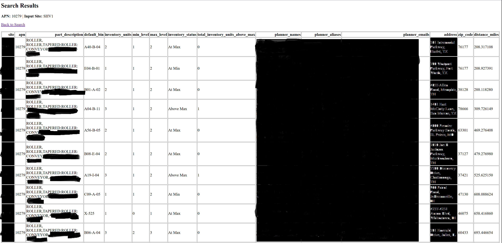
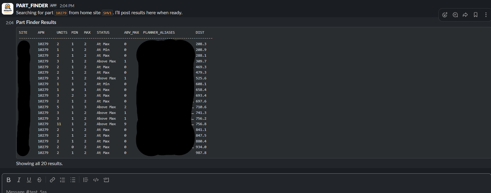

# Part Finder


## Business Problem


Maintenance and reliability teams often need to locate spare parts across multiple sites. This process is typically manual, requiring users to search multiple systems, contact planners, and compare inventory across locations. The process is time-consuming and can delay maintenance activities.


## Solution


Part Finder is an AWS-based inventory search application that enables users to quickly search for part availability across sites using either a web interface or Slack.

## Business Impact

The solution automated a manual part-transfer lookup process that previously required approximately 2–3 planner days per week. By consolidating inventory, planner, and site data into a searchable application with Slack integration, the process was reduced to less than 1 hour per week while improving response time and data accessibility.


The application automatically:


- Searches inventory across all sites
- Calculates distance from a user-provided home site
- Returns sites sorted from nearest to farthest
- Displays planner information for each site
- Provides both web and Slack-based access
- Automatically refreshes inventory data from source files
- Geocodes site addresses for distance calculations


## Key Features


- Distance-based part search
- Slack bot integration
- Flask web application
- Automated S3 data ingestion
- Redshift stored procedure processing
- Site geocoding using AWS Location Service
- Dockerized deployment on Amazon ECS
- Event-driven ETL pipeline using AWS Lambda


## Architecture


### Application Architecture





### Deployment & Data Pipeline Architecture





## Sample Outputs


### Flask Search Results





### Slack Search Results





## Technology Stack


### Backend

- Python
- Flask


### Cloud Services


- Amazon ECS
- Amazon ECR
- AWS Lambda
- Amazon S3
- Amazon Redshift Serverless
- API Gateway
- AWS Location Service
- CloudShell
- CloudWatch
- IAM


### Integration


- Slack API


### Data Processing


- SQL Stored Procedures
- CSV Data Files


### Deployment


- Docker


---


## Search Workflow


```text

User

↓

Slack App / Flask UI

↓

Flask Application (ECS)

↓

Part Search Lambda

↓

Amazon Redshift

↓

sp_search_part_distance()

↓

Results Returned

```


---


## Data Refresh Workflow


```text

Source Data Files

↓

Amazon S3

↓

S3 Event Trigger

↓

trigger_redshift_sp.py

↓

sp_part_transfer_pipeline()

↓

Staging Tables

↓

Dimension Tables

↓

Fact Tables

```


---


## Geocoding Workflow


```text

trigger_redshift_sp.py

↓

geocode_site_address.py

↓

AWS Location Service

↓

dim_sites

```


---


## Project Structure


```text

part-finder/
│
├── flask_app/
│   ├── app.py
│   └── templates/
│       ├── part_search_service.py
│       └──s3_sync_service.py
│
├── lambda/
│   ├── search_part_lambda.py
│   ├── trigger_redshift_sp.py
│   ├── geocode_site_address.py
│   └── slack_bot_handler.py
│
├── sql/
│   ├── create_tables.sql
│   ├── sp_part_transfer_pipeline.sql
│   ├── sp_search_part_distance.sql
│   └── grant_permissions.sql
│   └── validation.sql
│
├── docs/
│   ├── architecture.md
│   ├── deployment_architecture.md
│   ├── iam_permissions.md
│   ├── sample_outputs.md
│   ├── setup_steps.md
│   └── screenshots/
│
├── data_samples/
│
├── .env.example
├── Dockerfile
├── requirements.txt
└── README.md

```


---


## Setup Instructions


Detailed setup instructions are available here:


` docs/setup_steps.md`


The setup guide covers:


- AWS resource creation

- Redshift setup

- Lambda deployment

- ECS deployment

- Slack application setup

- IAM permissions

- Environment variables

- Docker deployment


---


## Documentation


| Document | Description |

|-----------|-------------|

| architecture.md | High-level application architecture |

| deployment_architecture.md | Deployment and data pipeline architecture |

| setup_steps.md | Complete deployment guide |

| iam_permissions.md | Required AWS and Redshift permissions |

| sample_outputs.md | Example application outputs |


---


## Environment Variables


The repository includes:


`.env.example`


Replace placeholder values with your own environment-specific values before deployment.


Examples include:


- AWS Region

- S3 Bucket Names

- API Gateway URLs

- Redshift Configuration

- Slack Tokens

- Slack Signing Secret


---


## Security Notes


This repository contains:


- Sample data only

- Placeholder AWS resources

- Placeholder IAM roles

- Placeholder URLs

- Placeholder secrets


No production credentials or proprietary data are included.


---


## Future Improvements


- Authentication and authorization

- CI/CD pipeline

- Infrastructure as Code (Terraform/CDK)

- Monitoring and alerting

- Additional search filters

- Enhanced Slack formatting

- Automated testing framework

- Inventory forecasting capabilities

- Quicksight interactive dashboards and visualizations


---


## Author


Sumanth Reddy Alugoti


Part Finder was developed as an end-to-end AWS inventory search solution demonstrating:


- Cloud Architecture

- Serverless Computing

- Data Engineering

- ETL Automation

- Containerization

- Slack Integration

- SQL Development

- Backend Application Development

